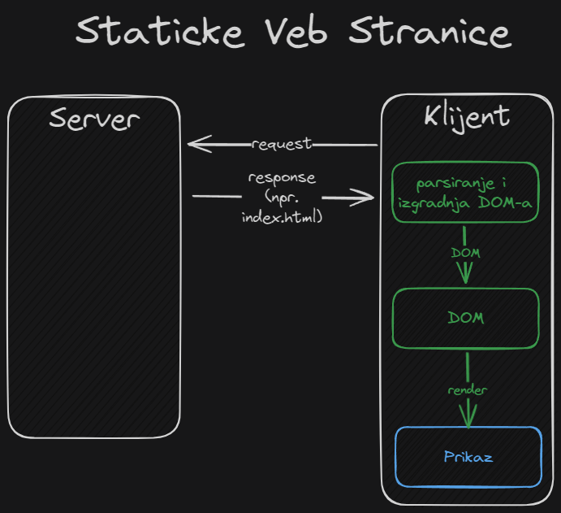
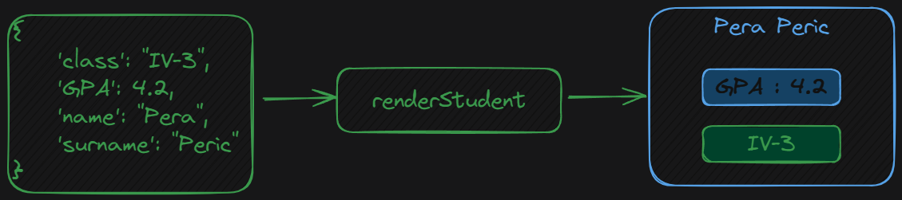
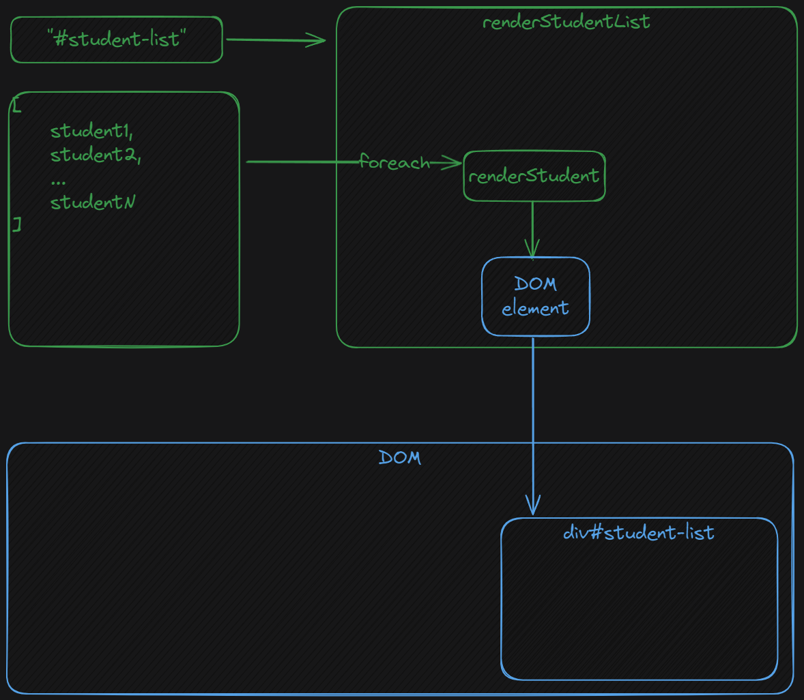

# Dinamicko renderovanje veb stranica

Ideja dinamickog renderovanja veb stranica implicira da postoji staticko renderovanje istih.
Pre nego sto zapocnemo pricu o dinamickom renderovanju, osvrnimo se na staticko.

## Staticke veb stranice

Staticke web stranice su karakteristicne po tome sto je njihov sadrzaj uvek isti nezavisno od toga ko, i odakle salje zahtev.
Za isti zahtev ce se renderovati uvek ista stranica.



Sa slike se vidi sledece (u hronoloskom poretku):

1. Slanje zahteva serveru
2. Odgovor servera slanjem index.html
3. Parsiranje html-a da bi se izgradio DOM
4. Renderovanje DOM-a i dobijanje UI-a

## Dinamicke veb stranice

Dinamicko renderovanje bi izgledalo ovako:


i sastoji se od sledecih koraka:

1. Slanje zahteva serveru
2. Odgovor servera slanjem index.html
3. Parsiranje html-a da bi se izgradio DOM
4. Podizanje event-a `ready` u trenutku kada se DOM izgradi
5. Pozivanje logike koja zahteva sada **korisne podatke** sa servera
6. Odgovor servera na zahtev u JSON formatu
7. Prihvatanje podataka u JSON formatu i dodavanje novih DOM elemenata u DOM
8. Rerenderovanje DOM-a

Imajte na umu da programer (na klijentskoj strani) kontrolise sve ono sto je obojeno narandzastom. Cim dodje do promene u DOM-u, browser ce automatski prikazati te promene u UI-u.
Odogovor servera kod dinamickih stranica moze zavisiti od kolacica, sesija, lokacije, koji je korisnik ulogovan, da li su dodatni parametri u zahtevu itd.

## Primer

U direktorijumu `example` je dat primer dinamickog renderovanja stranice i sadrzi sledeće fajlove:

- `index.html` - stranica koja sluzi za prikaz svih ucenika
- `data.js` - skripta koja sadrzi podatke koje simuliramo da su dosli sa servera
- `render.js` - skripta koja sadrzi logiku konverzije JSON objekata u DOM elemente
- `utils.js` - skripta koja sadrzi pomocne funkcije za manipulaciju listom JSON objekata

Cilj primera je da demonstrira kako se dinamicki na osnovu JSON objekata moze kreirati sadrzaj veb stranice.
JSON objekti simuliraju rezultat `fetch` operacije od klijenta ka serveru.
JSON objekti se prvo provlace kroz funkcije zaduzene za generisanje DOM elemenata.

### index.html

U zaglavlju stranice se nalaze `script` elementi za ucitavanje skripti neophodnih za funkcionalnost stranice.
Treba obratiti paznju na sledeci kod:

```html
<body
  onload="sort(students, 'GPA'); renderStudentList('#student-list',students)"
>
  <div class="" id="student-list"></div>
</body>
```

Kada se telo ucita u potpunosti (`onload` event), izvrsava se sortiranje niza `students` na osnovu atributa `GPA`, a zatime se renderuje niz JSON-a `students` tako da element koji drzi prikaz ima id `student-list`.
Takodje, element zaduzen za renderovanje kartica o studentima je staticki generisan.

### render.js

Sadrzi funkcije:

- `renderStudent` za generisanje DOM elementa koji predstavlja jednog studenta
- `renderStudentList` za prikaz svih studenata

#### renderStudent

Koristeci JQuery, kreiramo elemente koji sadrze bootstrap klase za lepsi i koherentniji prikaz podataka.
Cilj ove funkcije je da na osnovu podataka iz JSON objekta, kreira DOM element koji prikazuje podatke.
To se postize time sto se prilikom kreiranja DOM elemenata koriste \`\` (_backtick_) da bismo mogli u string da umetnemo vrednosti promenjivih.
Naravno, ne smemo zaboraviti da povezemo elemente u jednu celinu i tu celinu vratimo kao rezultat funkcije.



#### renderStudentList

Iako funkcija `renderStudent` uspesno generise DOM element za jednog studenta, taj element nece biti vidljiv dok se ne doda u DOM stablo. Tu ulogu ima funkcija `renderStudentList`. Ona prima listu studenata kao parametar, kao i string selektor na osnovu kojeg bira DOM element koji ce biti roditelj svim dinamicki generisanim DOM elementima. Tek kada se elementi dodaju na stablo, oni postaju vidljivi.



### utils.js

Skirpta koja sadrzi pomocne funkcije za rad sa listama JSON objekata.

#### sortBy

Funckija koja prima string atribut po kome se vrsi poredjenje i vraca **funkciju** koja vrsi poredjenje dva elementa na osnovu datog atributa.

#### sort

Funkcija koja prima niz i kriterijum sortiranja, i sortira dati niz po tom kriterijumu u rastucem poretku.
