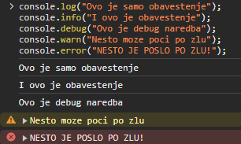
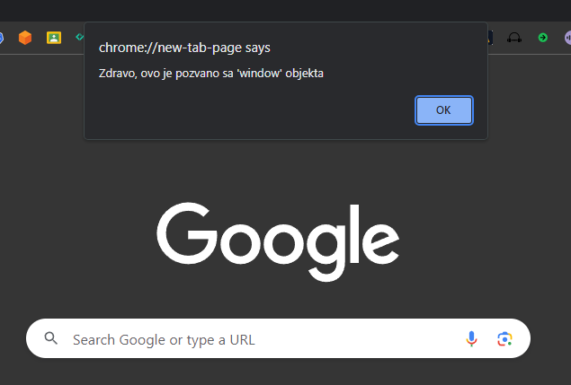

# Javascript

Javascript je jezik koji se primarno koristio za programiranje klijetskog dela
web aplikacija, ali se od skorijeg vremena koristi i na serveru uz pomoc node.js
runtime okruzenja.

## Sintaksa

Sintaksa javascript-a podseca dosta na programski jezik C, stim sto je dinamicki
tipiziran. U prevodu, kada deklarisemo promenjive ili parametre, ne mozemo da
navedemo kog ce tipa biti, ali tokom rada programa (runtime), tipovi promenjivih
se zakljucuju na osnovu vrednosti koje sadrze. Takodje, javascript je skriptni
jezik koji se interpretira. To znaci da se kod moze izvrsavati van funkcija i da
je najsira oblast vazenja promenjivih sam fajl u kom su definisane.

### Definisanje promenjivih

Promenjive se mogu definisati kljucnim recima `let` ili `var`, mada novije
konvencije predlazu `let`. Promenjive nisu tipizirane.

```js
// deklarisana promenjiva a
let a;
// deklarisana promenjiva b i inicijalizovana
let b = a + 1;
// deklarisana promenjiva c
let c = 3.14;
// dodeljena vrednost promenjivoj a
a = 5;
// dodeljena druga vrednost promenjivoj a drugog tipa
a = "Hello World";
// deklarisana konstanta koja ima vrednost promenjive a
const d = a;
```

### Tipovi podataka

U javascript-u je skoro sve objekat. Sve vrednosti osim primitiva, su objekti.
Primitive su u sustini literali i ono sto je karakteristicno za njih jeste sto
nemaju svojstva niti metode.

| Tip Podatka | Opis                                        | Primer Literala                 |
| ----------- | ------------------------------------------- | ------------------------------- |
| String      | Тekstualni podatak                          | `'Zdravo, svete!'`              |
| Number      | Numerički podatak                           | `42`, `3.14`                    |
| Boolean     | Logička vrednost                            | `true`, `false`                 |
| Null        | Namerno odsustvo vrednosti                  | `null`                          |
| Undefined   | Neinicijalizovana ili nepostojeća vrednost  | `undefined`                     |
| Symbol      | Jedinstveni identifikator (ES6+)            | `let mojSimbol = Symbol();`     |
| Object      | Kolekcija parova ključ-vrednost             | `{ ime: 'John', 'godine': 34 }` |
| BigInt      | Celobrojna vrednost proizvoljne preciznosti | `BigInt(9007199254740991)`      |

### Ulaz i izlaz

S obzirom da je javascript nastao za potrebe programiranja browsera, on nema
podrazumevani nacin ulaza/izlaza. Stavise, u klijentskom okruzenju, ne postoji
nacin da se ucita nesto sa standardnog ulaza, jer on ne postoji. Sa druge
strane, postoji ekvivalent standardnom izlazu, a to je objekat `console`.
Koriscenjem metode `log` mozemo na browser konzolu ispisati sta god zelimo.
Postoji nekoliko metoda za ispis na konzolu i nivo ozbiljnosti:

| Metoda  | Nivo    |
| :------ | :------ |
| `log`   | Info    |
| `info`  | Info    |
| `debug` | Verbose |
| `warn`  | Warning |
| `error` | Error   |

```js
console.log("Ovo je samo obavestenje");
console.info("I ovo je obavestenje");
console.debug("Ovo je debug naredba");
console.warn("Nesto moze poci po zlu");
console.error("NESTO JE POSLO PO ZLU!");
```

Ako se ovaj kod pokrene dobijemo:



[Dokumentacija o `console` objektu.](https://developer.mozilla.org/en-US/docs/Web/API/console)

Takodje, jedan od nacina izlaza koji je specifican za browser jeste alert.
Metoda `alert` stvara mini-prozor na vrhu pretrazivaca.

```js
alert("Zdravo, ovo je pozvano sa 'window' objekta").
```



### Operatori

Operatori u javascriptu su standardni operatori familije C jezika.

| Ime                      | Operator | Primer                                                    | Rezultat                              |
| ------------------------ | -------- | --------------------------------------------------------- | ------------------------------------- |
| Dodeljivanje             | `=`      | `let x = 5;`                                              | `x` je dodeljeno vrednost `5`         |
| Sabiranje                | `+`      | `let zbir = 3 + 4;`                                       | `zbir` je `7`                         |
| Oduzimanje               | `-`      | `let razlika = 8 - 3;`                                    | `razlika` je `5`                      |
| Množenje                 | `*`      | `let proizvod = 2 * 6;`                                   | `proizvod` je `12`                    |
| Deljenje                 | `/`      | `let kolicnik = 10 / 2;`                                  | `kolicnik` je `5`                     |
| Ostatak (Moduo)          | `%`      | `let ostatak = 15 % 4;`                                   | `ostatak` je `3`                      |
| Stepenovanje             | `**`     | `let rezultat = 2 ** 3;`                                  | `rezultat` je `8`                     |
| Inkrement                | `++`     | `let brojac = 1; brojac++;`                               | `brojac` je sada `2`                  |
| Dekrement                | `--`     | `let brojac = 3; brojac--;`                               | `brojac` je sada `2`                  |
| Jednakost (labavo)       | `==`     | `5 == '5';`                                               | `true` (vrednosti su konvertovane)    |
| Stroga Jednakost         | `===`    | `5 === '5';`                                              | `false` (proverava se i tip)          |
| Nejednakost (labavo)     | `!=`     | `5 != '5';`                                               | `false` (vrednosti su konvertovane)   |
| Stroga Nejednakost       | `!==`    | `5 !== '5';`                                              | `true` (proverava se i tip)           |
| Veće od                  | `>`      | `10 > 5;`                                                 | `true`                                |
| Manje od                 | `<`      | `3 < 7;`                                                  | `true`                                |
| Veće ili Jednako         | `>=`     | `5 >= 5;`                                                 | `true`                                |
| Manje ili Jednako        | `<=`     | `4 <= 3;`                                                 | `false`                               |
| Logičko I                | `&&`     | `true && false;`                                          | `false`                               |
| Logičko ILI              | `\|\|`   | `true \|\| false;`                                        | `true`                                |
| Logičko NIJE             | `!`      | `!true;`                                                  | `false`                               |
| Ternarni (Uslovni)       | `? :`    | `let rezultat = (x > 0) ? 'pozitivno' : 'non-pozitivno';` | Zavisi od vrednosti `x`               |
| Bitovsko I               | `&`      | `5 & 3;`                                                  | `1` (bitovsko I od 0101 i 0011)       |
| Bitovsko ILI             | `\|`     | `5 \| 3;`                                                 | `7` (bitovsko ILI od 0101 i 0011)     |
| Bitovsko XOR             | `^`      | `5 ^ 3;`                                                  | `6` (bitovsko XOR od 0101 i 0011)     |
| Bitovsko NIJE            | `~`      | `~5;`                                                     | `-6` (bitovsko NIJE od 0101)          |
| Pomeraj Levo             | `<<`     | `8 << 2;`                                                 | `32` (pomeraj levo za 2 bita)         |
| Pomeraj Desno            | `>>`     | `16 >> 2;`                                                | `4` (pomeraj desno za 2 bita)         |
| Neoznačeni Pomeraj Desno | `>>>`    | `-1 >>> 1;`                                               | `2147483647` (logički pomeraj udesno) |

### Upravljacke strukture

#### Grananja

##### if-else

```js
let poena = 85;

if (poena >= 85) {
    console.log("Ocena: 5");
} else if (poena >= 70) {
    console.log("Ocena: 4");
} else if (poena >= 55) {
    console.log("Ocena: 3");
} else if (poena >= 40) {
    console.log("Ocena: 2");
} else {
    console.log("Ocena: 1");
}
```

##### switch

```js
let day = "Monday";

switch (day) {
    case "Monday":
        console.log("It's the beginning of the week.");
        break;
    case "Saturday":
    case "Sunday":
        console.log("It's the weekend!");
        break;
    default:
        console.log("It's a weekday.");
}
```

#### Petlje

##### for

```js
for (let i = 1; i <= 5; i++) {
    console.log("Iteration number: " + i);
}
```

##### while

```js
let count = 1;

while (count <= 5) {
    console.log("Iteration number: " + count);
    count++;
}
```

##### do while

```js
let count = 1;

do {
    console.log("Iteration number: " + count);
    count++;
} while (count <= 5);
```

### Funkcije

Definisanje funkcija u javascript-u se moze obaviti na nekoliko nacina:

```js
// Funkcija bez parametara i bez povratne vrednosti
function greet() {
    console.log("Hello!");
}

// Funkcija sa parametrima i sa povratnom vrednoscu
function add(a, b) {
    return a + b;
}

// Promenjiva multiply predstavlja funkciju
let multiply = function (x, y) {
    return x * y;
};

// Promenjiva subtract je lambda koja prima dva broja i racuna njihovu razliku
let subtract = (a, b) => a - b;
```

Ove funkcije dalje mozemo pozvati:

```js
greet(); // ispisuje Hello!

let sum = add(3, 4);
console.log("Sum:", sum); // ispisuje: Sum: 7

let product = multiply(2, 5);
console.log("Product:", product); // Ispisuje: Product: 10

let difference = subtract(8, 3);
console.log("Difference:", difference); // Ispisuje: Difference: 5
```

### Objekti

U javascriptu se objekat najcesce kreira na sledeca dva nacina

1. Koriscenjem objekat literala
2. Koriscenjem kljucne reci `new`

#### 1. Koriscenjem literala

```js
const osoba = { ime: "Pera", prezime: "Peric", godiste: 1989 };
```

#### 2. Kljucna rec `new`

```js
const osoba = new Object();
osoba.ime = "Pera";
osoba.prezime = "Peric";
osoba.godiste = 1989;
```

Javascript objekti su zapravo reference tako da vazi:

```js
const osoba = {
    ime: "Pera",
    prezime: "Peric",
    godiste: 1989,
};

const x = osoba;
x.godiste = 2006; // promena se odrazava i na x.godiste i na osoba.godiste
```

`x` i `osoba` su pokazivaci (reference) na isti objekat u memoriji.

Kada se koristi u kontekstu klijentskog programiranja (browser-a) onda
javascript ima pristup skupu funkcionalnosti koje jednim imenom zovemo **browser
API**.

Ono sto nam browser API omogucava jesu sledece funkcionalnosti:

-   **Manipulacija DOM-om**: Manipulacija strukturom DOM stabla i sadrzajem
    elemenata unutar DOM stabla

-   **Dogadjaji**: Mehanizmi za upravljanje i odgovaranje na dogadjaje, poput
    kucanja na tastaturi, kliktanje misa, ucitavanje dokumenta itd.

-   **AJAX (Asynchronous Javascript And XML)** : mogucnost slanja i primanja
    struktuiranih podataka van standardnog request/response ciklusa

-   **Canvas i WebGL** : Mehanizme za crtanje 2D i 3D grafike unutar
    pretrazivaca

-   **Geolokacija** : Pristup geografskoj lokaciji korisnika

-   **Obavestenja** : Dozvoljava stranicama da prikazu obavestenja korisnicima

-   **WebSocket-i** : Omogucuje bidirekcionu komunikaciju u realnom vremenu
    izmedju browsera i servera koriscenjem jedne dugotrajne konekcije

## Manipulacija DOM-om

### Selekcija i pristup elementima

Nacin pristupa DOM stablu se vrsi preko `document` objekta. Elementima DOM-a
mozemo pristupati na osnovu:

-   tipa elementa `document.getElementsByTagName('div')`
-   klase `document.getElementsByClassName('card')`
-   id-a `document.getElementById('search-input')`
-   atributa name `document.getElementsByName('email')`
-   kombinovano
    -   `document.querySelector('button.btn-primary#accept')`
    -   `document.querySelectorAll('input[type='text']')`

Treba imati u vidu da ove metode vracaju referencu na jedan element ili listu
elemenata koji zadovoljavaju uslov selekcije.

### Menjanje sadrzaja elemenata
